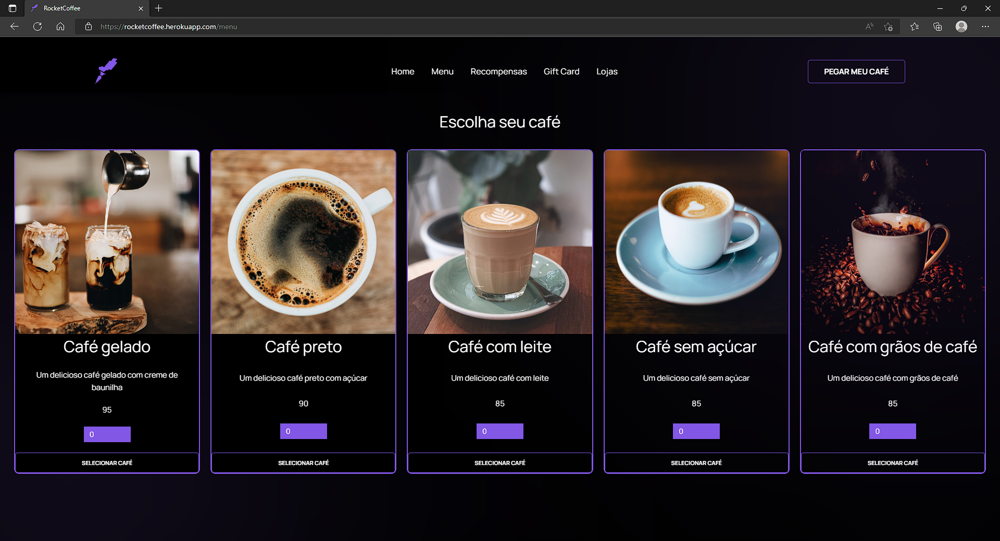

# RocketCoffee | Desafio Rocketseat

## Português

### Homepage para uma marca de café

Front-end feito em React usando um pouco de styled-components e redux. Para ir além, implementou-se um back-end em Node com Express e MongoDB como banco de dados não relacional. A aplicação permite ao usuário escolher cafés em estoque. Ela permite ao administrador visualizar, adicionar e editar cafés, bem como visualizar o histórico de pedidos.

## English

### Homepage for a coffee brand

Front end made in React using a bit of styled-components and redux. To go further, a backend was implemented in Node with Express and MongoDB as a non-relational database. The application allows the user to choose coffees in stock. It allows the administrator to view, add, and edit coffees, as well as view order history.

## Screenshots

  
  
  
  
  

  
## Stack

     